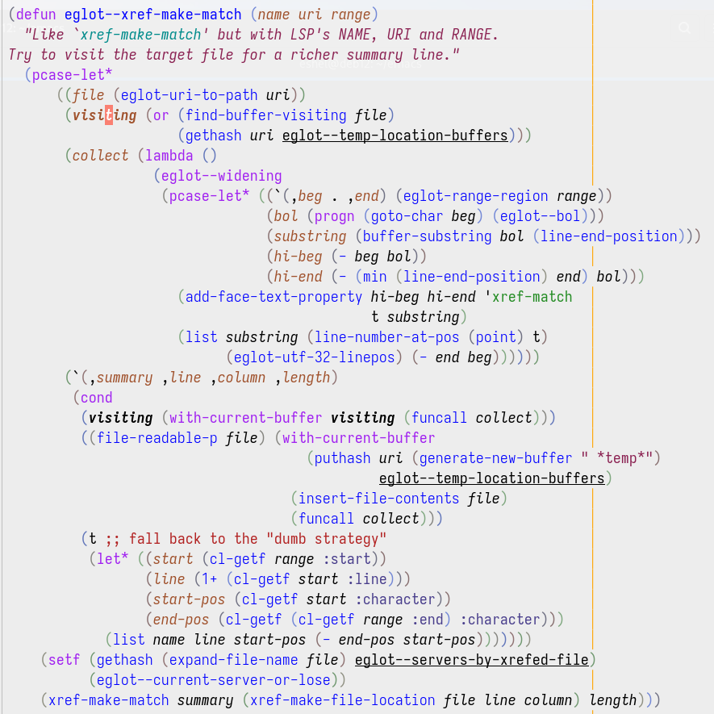

# Semantic highlighting for Emacs Lisp

## Installation

Install from Git with your package manager of choice.

## Usage

```elisp
(add-hook 'emacs-lisp-mode-hook #'semel-mode)
(add-hook 'emacs-lisp-mode-hook #'cursor-sensor-mode)  ; Optional.
```

`semel-mode` analyzes Emacs Lisp code, highlighting each symbol it
encounters according to its meaning (semantic highlighting).

By default, it also adds some help text to symbols via the `help-echo`
text property, so you can hover over a symbol with the mouse to learn
exactly what that symbol does/means.  The user option
`semel-add-help-echo` lets you control this behavior.

If you additionally enable `cursor-sensor-mode`, then `semel-mode`
also highlights all occurrences of the local variable at point with a
bold face.

## Screenshot



## Tips

- Semantic highlighting works best when you keep your code
  syntactically correct while editing, by using `electric-pair-mode`
  or `paredit` etc.
- In trusted buffers (see `trusted-content`), `semel` expands macros
  during code analysis.  You can customize the user option
  `scope-safe-macros` to specify macros that you want `semel` to
  expand in any buffer.
